# Prerequisites

This notebooks assumes a Neo4J instance running and accessible at http://localhost:7474.

A convenient way to do so is to pull neo4j docker image and run it locally:

```bash
docker pull neo4j
docker run --name neo4j -p7474:7474 -p7687:7687 --env NEO4J_AUTH=neo4j/test -d neo4j
```

When doing this on Windows you may also need to run with following parameters:

```bash
--env NEO4J_dbms_connector_https_advertised__address="localhost:7473"
--env NEO4J_dbms_connector_http_advertised__address="localhost:7474"
--env NEO4J_dbms_connector_bolt_advertised__address="localhost:7687"
```

Also, free desktop version for Windows users might be easier to use.

There exists an easy way to interact with neo4j using R thanks to the neo4r library. We will use it along this notebook (and also some other useful libraries).

```{r echo=T}
library(neo4r)
library(magrittr)
```

# Let's start

Now that we are set, we will use Neo4J in order to model the evidences of a crime that has occurred while sleeping at the Orient Express.

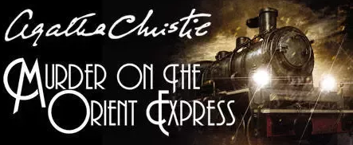

We will use Neo4J to model our knowledge about the crime scene and do some inference trying to discover who the murderer is.

```{r}
con <- neo4j_api$new(url = "http://localhost:7474", user = "neo4j", password = "test")
```

Now that our connection is established we can start by defining the context: our train. There are twelve train coaches and given that the suspect is still inside the train, everyone inside those is a suspect. Everyone except the victim.

```{r}
q<-"CREATE (:VICTIM :PERSON {name : 'Samuel Edward Ratchett', country: 'USA'})" %>% call_neo4j(con)
"CREATE (:COACH {number: 7, class : 'first'})" %>% call_neo4j(con)
```

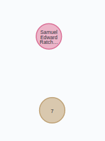

```{r}
"MATCH (n:VICTIM), (c:COACH) WHERE c.number = 7 MERGE (n)-[:STAYED]->(c)" %>% call_neo4j(con)
```

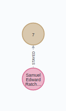

While investigating we have discovered a pocket watch stopped at 1:15AM, approximately the same time the night before some incident happened on that coach. According to the conductor Pierre Michel who visited Mr. Rachett at 00:37AM approximately due to some noise at the compartment.

```{r}
"MATCH (v:VICTIM) SET v.deadtime = localtime('01:00:00.000')" %>% call_neo4j(con)
```

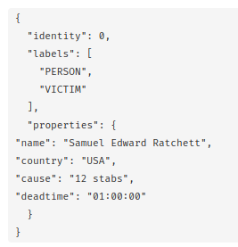

```{r}
"CREATE (:CONDUCTOR :PERSON {name : 'Pierre Michell', country: 'FRANCE'})" %>% call_neo4j(con)
```

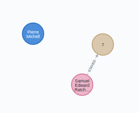

```{r}
"MATCH (n:CONDUCTOR), (c:COACH) WHERE c.number = 7 MERGE (n)-[:VISITED {time : localtime('00:37:00.000')}]->(c)" %>% call_neo4j(con)
```

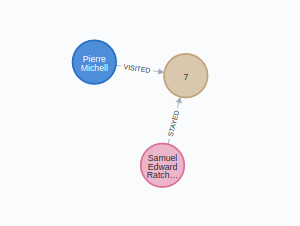

We also found a female napkin with an *H* embroidered, a pipe cleaner and the button of the conductor jacket.

```{r}
"MATCH (c:CONDUCTOR) SET c:SUSPECT " %>% call_neo4j(con)
```

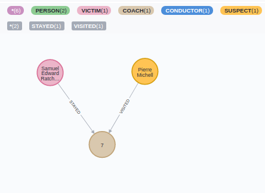

Lets look for females whose initials are an H. Mrs Hubbard stays in coach number 6, next to Rachett's.

```{r}
"CREATE (:SUSPECT:PERSON {name : 'Mrs. Hubbard', gender: 'female'})" %>% call_neo4j(con)
```

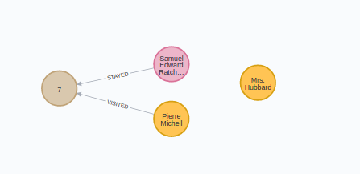

She is a famous actress by the name of Linda Arden, from USA as well. Apart from being famous due to her profession, her family was involved in a tragic scandal when somebody kidnapped and murdered her gran daughter, Daisy Armstrong. Daisy's mother, Sonia, also died while in labor prematurely of her second child after finding out Daisy's dead. The father committed suicide.

```{r}
q<-"CREATE (d:PERSON {name : 'Daisy Armstrong', gender: 'female'})
CREATE (m:PERSON {name : 'Sonia Armstrong', gender: 'female'})
CREATE (f:PERSON {name : 'John Armstrong', gender: 'male'})
MERGE (f)-[:FATHER]->(d)<-[:MOTHER]-(m)"
call_neo4j(q,con=con)
```

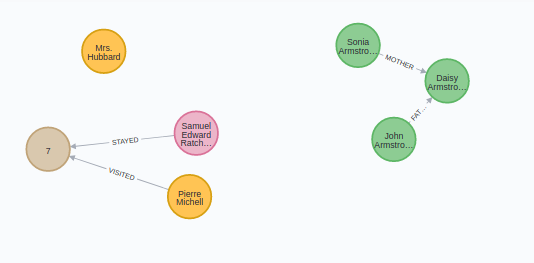

Mrs. Hubbard's second daughter also travels inside the same train, coach 5. She is now Helena Andrenyi. 

```{r}
"CREATE (:SUSPECT:PERSON {name : 'Helena Andrenyi', gender: 'female'})" %>% call_neo4j(con)
```

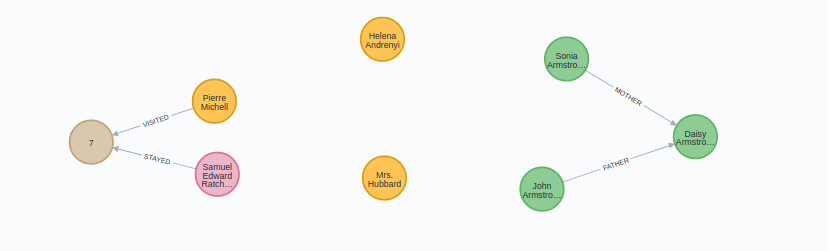

Interesting, Helena also starts with an *H*.

```{r}
q<-"MATCH (h:PERSON {name : 'Helena Andrenyi'})
MATCH (m:PERSON {name : 'Mrs. Hubbard'})
MATCH (s:PERSON {name : 'Sonia Armstrong'})
MATCH (d:PERSON {name : 'Daisy Armstrong'})
MERGE (s)<-[:MOTHER]-(m)-[:MOTHER]->(h)-[:AUNT]->(d)"
call_neo4j(q,con=con)
```

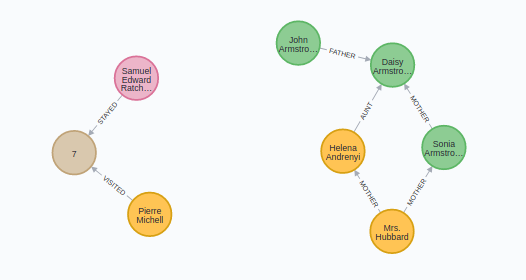

Poor family. Lets continue with the rest of the suspects... in particular those with an H on their names. There is a female on the second class, Hildegarde Schmidt.

```{r}
"CREATE (:SUSPECT:PERSON {name : 'Hildegarde Schmidt', gender: 'female', country : 'GERMANY', profession : 'cook'})" %>% call_neo4j(con)
```

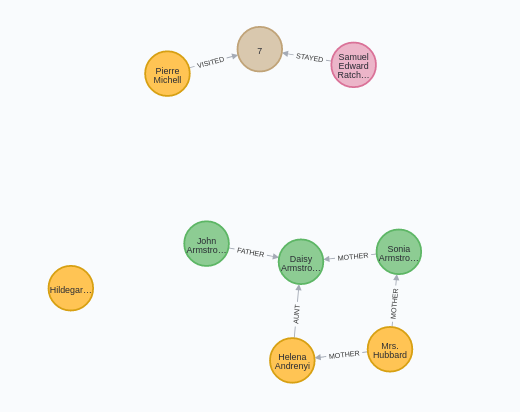

Funny story, she was the cook of the Armstrong family. What are the odds! She also remembers the poor Susanne, the family maid who was found guilty and after hanging herself the exculpated her due to the lack of evidences and finding that an American wealthy man called Casetti was found guilty. She also remember Pierre, the conductor, visiting his daughter Susanne at the Armstrong family house.

```{r}
"CREATE (:PERSON {name : 'Susanne', gender: 'female', country : 'FRANCE', profession : 'maid'})" %>% call_neo4j(con)
```

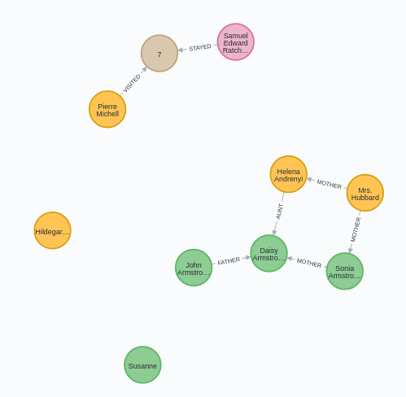

```{r}
q<-"MATCH (s:PERSON {name : 'Susanne', profession : 'maid'})
MATCH (p:PERSON {name : 'Pierre Michell'})
MERGE (p)-[:FATHER]->(s)"
call_neo4j(q,con=con)
```

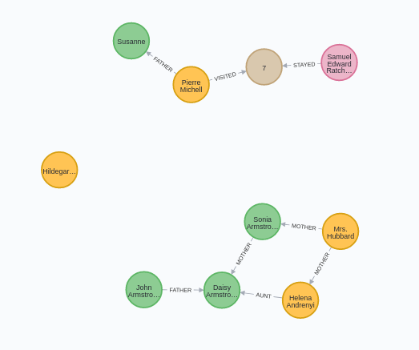

What a coincidence. So the two ladies with an *H* in their names are in subsequent coaches to the victim. The only female suspect with an H in her name is siting on a second class coach.

```{r}
q<-"
CREATE (c1:COACH {number: 1, class : 'first'})
CREATE (c2:COACH {number: 2, class : 'first'})
CREATE (c3:COACH {number: 3, class : 'first'})
CREATE (c4:COACH {number: 4, class : 'first'})
CREATE (c5:COACH {number: 5, class : 'first'})
CREATE (c6:COACH {number: 6, class : 'first'})
CREATE (:COACH {number: 10, class : 'second'})
WITH c1, c2, c3, c4, c5, c6
MATCH (c7:COACH {number: 7, class : 'first'})
MERGE (c1)-[:NEXT]->(c2)-[:NEXT]->(c3)-[:NEXT]->(c4)-[:NEXT]->(c5)-[:NEXT]->(c6)-[:NEXT]->(c7)"
call_neo4j(q,con=con)
```

```{r}
q<-"
MATCH (c:COACH)
MATCH (s:PERSON {name : 'Hildegarde Schmidt'})
WHERE c.number = 10
MERGE (s)-[:STAYED]->(c)"
call_neo4j(q,con=con)
```

```{r}
q<-"
MATCH (c:COACH)
MATCH (s:PERSON)
WHERE c.number = 6 AND s.name =~ '.*Hubbard.*'
MERGE (s)-[:STAYED]->(c)"
call_neo4j(q,con=con)
```

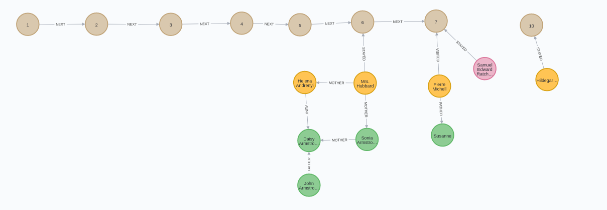
Curious enough, Ms. Andrenyi's husband, Count Rudolph Andrenyi also is traveling in the same train.

```{r}
q<-"
MERGE (p:PERSON {name : 'Rudolph Andrenyi', country : 'HUNGARY', tnobility : 'count'})
WITH p
MATCH (c:PERSON)
WHERE c.name =~ 'Helena .*'
SET c.tnobility = 'countess'
MERGE (p)-[:SPOUSE]->(c)"
call_neo4j(q,con=con)

q<-"
MATCH (c:COACH)
MATCH (s:PERSON)
WHERE c.number = 5 AND s.name =~ '.*Andrenyi'
MERGE (s)-[:STAYED]->(c)"
call_neo4j(q,con=con)
```

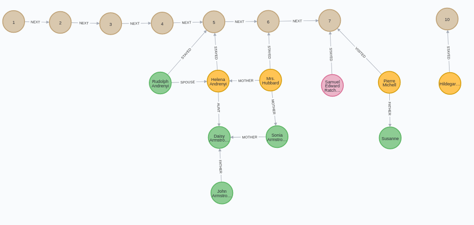

But count and countess Andrenyi travels on a separate compartments. He is in first class coach number 4.

```{r}
q<-"
MATCH (c:PERSON {tnobility : 'count'})
WITH c
MATCH (c)-[r:STAYED]->(:COACH)
DELETE r
WITH c
MATCH (c4:COACH)
WHERE c4.number = 4
MERGE (c4)<-[:STAYED]-(c)"
call_neo4j(q,con=con)
```

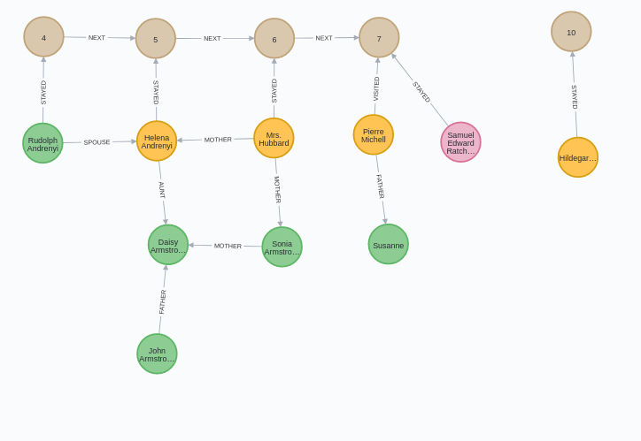

So it seems many people is related to that Armstrong familly. Has that anything to do with the victim?

```{r}
q<-"
CREATE (f:FAMILY {name : 'Armstrong'})
WITH f
MATCH (a: PERSON)
WHERE a.name =~ '.*Armstrong'
MERGE (a)-[:MEMBER]->(f)
WITH f
MATCH (p :PERSON)
WHERE p.profession = 'cook' OR p.profession = 'maid'
MERGE (p)-[:WORKED {as : p.profession}]->(f)"
call_neo4j(q,con=con)
```

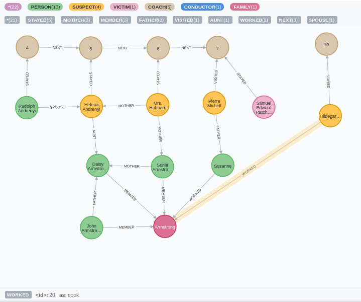

How many people is related to them and how distant is their relationship?

```{r}
q<-"
MATCH graph = (:COACH)<--(p:PERSON)-[r*1..10]->(f:FAMILY)
WHERE NOT (p)-[:MEMBER]->(f)
RETURN p.name AS suspect, COUNT(*) AS degree
ORDER BY degree DESC"
j <- call_neo4j(q,con=con, type="row", output="json")
j
```
That's nasty.

```{r}
convert <- function(json){
  l <- jsonlite::fromJSON(json)[[1]][["row"]]
  return(data.frame(matrix(unlist(l), nrow=length(l), byrow=T)))
}
df <- convert(j)
df
```
Ok, so five people on the train have tight relationships with the Armstrong family. One of them actually has three different connections to them being 2 of those people in the very same train. Even the conductor is involved. 

I need to go back to the body to see if I am missing something. Oh my! Several threat notes are found on Rachett's compartment, handwritten threat notes. One is burnt but you could clearly read: *-remember little Daisy*. Rachett was also related to Daisy Armstrong?

```{r}
"MATCH (v:VICTIM), (d:PERSON {name : 'Daisy Armstrong'})
MERGE (v)-[:RELATED]->(d)" %>% call_neo4j(con=con)
```

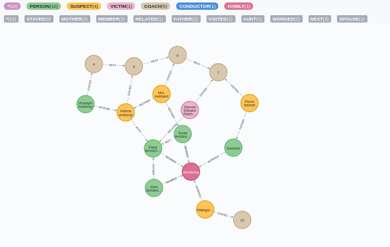

What a mess!

