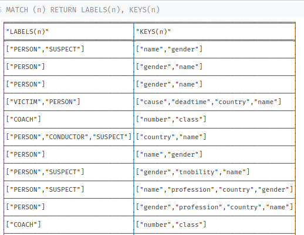
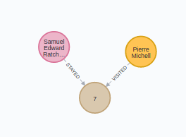
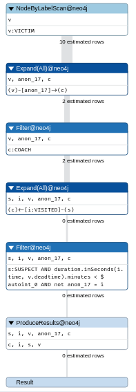
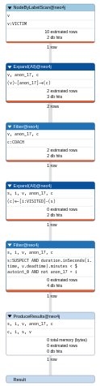

# Prerequisites

This notebooks assumes a Neo4J instance running and accessible at http://localhost:7474.

There exists an easy way to interact with neo4j using R thanks to the neo4r library. We will use it along this notebook (and also some other useful libraries).

```{r echo=T}
library(neo4r)
library(magrittr)
```

# Let's start

Now that we are set, we will use Neo4J in order to model the evidences of a crime that was committed while sleeping at the Orient Express.


We will use Neo4J to model our knowledge about the crime scene and do some inference trying to discover who the murderer is.

```{r}
con <- neo4j_api$new(url = "http://localhost:7474", user = "neo4j", password = "test")
```

Now that our connection is established we can start by defining the context: our train. There are twelve train coaches and given that the suspect is still inside the train, everyone inside those is a suspect. Everyone except the victim.

```{r}
"CREATE (:VICTIM :PERSON {name : 'Samuel Edward Ratchett', country: 'USA'})" %>% call_neo4j(con)
"CREATE (:COACH {number: 7, class : 'first'})" %>% call_neo4j(con)
```


```{r}
"MATCH (n:VICTIM), (c:COACH) WHERE c.number = 7 MERGE (n)-[:STAYED]->(c)" %>% call_neo4j(con)
```


While investigating we have discovered a pocket watch stopped at 1:00AM. That's the approximate time some incident happened the night before on that coach, according to the conductor (Pierre Michel) who visited Mr. Rachett exactly at 00:37AM. Other passengers heard noises coming out of coach number 7.

```{r}
"MATCH (v:VICTIM) SET v.deadtime = localtime('01:00:00.000')" %>% call_neo4j(con)
```


```{r}
"CREATE (:CONDUCTOR :PERSON {name : 'Pierre Michell', country: 'FRANCE'})" %>% call_neo4j(con)
```


```{r}
"MATCH (n:CONDUCTOR), (c:COACH) WHERE c.number = 7 MERGE (n)-[:VISITED {time : localtime('00:37:00.000')}]->(c)" %>% call_neo4j(con)
```


We also found a female napkin with an *H* embroidered, a pipe cleaner and a jacket button. Looks similar to the ones on conductor's jacket.

```{r}
"MATCH (c:CONDUCTOR) SET c:SUSPECT " %>% call_neo4j(con)
```


Lets look for females whose initials are an H. Mrs Hubbard stays in coach number 6, next to Rachett's.

```{r}
"CREATE (:SUSPECT:PERSON {name : 'Mrs. Hubbard', gender: 'female'})" %>% call_neo4j(con)
```


She is a famous actress by the name of Linda Arden, from USA as well. Apart from being famous due to her profession, her family was involved in a tragic scandal when somebody kidnapped and murdered her gran daughter, Daisy Armstrong. Daisy's mother, Sonia, also died while in labor prematurely of her second child after finding out Daisy's dead. The father committed suicide.

```{r}
q<-"CREATE (d:PERSON {name : 'Daisy Armstrong', gender: 'female'})
CREATE (m:PERSON {name : 'Sonia Armstrong', gender: 'female'})
CREATE (f:PERSON {name : 'John Armstrong', gender: 'male'})
MERGE (f)-[:FATHER]->(d)<-[:MOTHER]-(m)"
call_neo4j(q,con=con)
```


Mrs. Hubbard's second daughter also travels inside the same train, coach number 5. She is now Helena Andrenyi. 

```{r}
"CREATE (:SUSPECT:PERSON {name : 'Helena Andrenyi', gender: 'female'})" %>% call_neo4j(con)
```


Interesting, Helena also starts with an *H*.

```{r}
q<-"MATCH (h:PERSON {name : 'Helena Andrenyi'})
MATCH (m:PERSON {name : 'Mrs. Hubbard'})
MATCH (s:PERSON {name : 'Sonia Armstrong'})
MATCH (d:PERSON {name : 'Daisy Armstrong'})
MERGE (s)<-[:MOTHER]-(m)-[:MOTHER]->(h)-[:AUNT]->(d)"
call_neo4j(q,con=con)
```


Poor family. Lets continue with the rest of the suspects... in particular those with an H on their names. There is a female on second class, Hildegarde Schmidt.

```{r}
"CREATE (:SUSPECT:PERSON {name : 'Hildegarde Schmidt', gender: 'female', country : 'GERMANY', profession : 'cook'})" %>% call_neo4j(con)
```


Funny story, she was the cook of the Armstrong family. What are the odds! She also remembers the poor Susanne, the family maid who was found guilty and after hanging herself she was exculpated due to the lack of evidences. Also, an American wealthy man called Casetti was found guilty. She also remembers Pierre, the conductor, visiting his daughter Susanne at the Armstrong family house. Interesting...

```{r}
"CREATE (:PERSON {name : 'Susanne', gender: 'female', country : 'FRANCE', profession : 'maid'})" %>% call_neo4j(con)
```


```{r}
q<-"MATCH (s:PERSON {name : 'Susanne', profession : 'maid'})
MATCH (p:PERSON {name : 'Pierre Michell'})
MERGE (p)-[:FATHER]->(s)"
call_neo4j(q,con=con)
```


What a coincidence. So the two ladies with an *H* in their names are in subsequent coaches to the victim. The only suspect left with an *H* in her name is the former cook siting on a second class coach.

```{r}
q<-"
CREATE (c1:COACH {number: 1, class : 'first'})
CREATE (c2:COACH {number: 2, class : 'first'})
CREATE (c3:COACH {number: 3, class : 'first'})
CREATE (c4:COACH {number: 4, class : 'first'})
CREATE (c5:COACH {number: 5, class : 'first'})
CREATE (c6:COACH {number: 6, class : 'first'})
CREATE (:COACH {number: 10, class : 'second'})
WITH c1, c2, c3, c4, c5, c6
MATCH (c7:COACH {number: 7, class : 'first'})
MERGE (c1)-[:NEXT]->(c2)-[:NEXT]->(c3)-[:NEXT]->(c4)-[:NEXT]->(c5)-[:NEXT]->(c6)-[:NEXT]->(c7)"
call_neo4j(q,con=con)
```

```{r}
q<-"
MATCH (c:COACH)
MATCH (s:PERSON {name : 'Hildegarde Schmidt'})
WHERE c.number = 10
MERGE (s)-[:STAYED]->(c)"
call_neo4j(q,con=con)
```

```{r}
q<-"
MATCH (c:COACH)
MATCH (s:PERSON)
WHERE c.number = 6 AND s.name =~ '.*Hubbard.*'
MERGE (s)-[:STAYED]->(c)"
call_neo4j(q,con=con)
```


Curious enough, Mrs. Andrenyi's husband, Count Rudolph Andrenyi, is also traveling in the same train.

```{r}
q<-"
MERGE (p:PERSON {name : 'Rudolph Andrenyi', country : 'HUNGARY', tnobility : 'count'})
WITH p
MATCH (c:PERSON)
WHERE c.name =~ 'Helena .*'
SET c.tnobility = 'countess'
MERGE (p)-[:SPOUSE]->(c)"
call_neo4j(q,con=con)

q<-"
MATCH (c:COACH)
MATCH (s:PERSON)
WHERE c.number = 5 AND s.name =~ '.*Andrenyi'
MERGE (s)-[:STAYED]->(c)"
call_neo4j(q,con=con)
```


But count and countess Andrenyi travel on separate compartments. He is in first class coach number 4.

```{r}
q<-"
MATCH (c:PERSON {tnobility : 'count'})
WITH c
MATCH (c)-[r:STAYED]->(:COACH)
DELETE r
WITH c
MATCH (c4:COACH)
WHERE c4.number = 4
MERGE (c4)<-[:STAYED]-(c)"
call_neo4j(q,con=con)
```


So it seems many people is related to that Armstrong family. Has that anything to do with the victim?

```{r}
q<-"
CREATE (f:FAMILY {name : 'Armstrong'})
WITH f
MATCH (a: PERSON)
WHERE a.name =~ '.*Armstrong'
MERGE (a)-[:MEMBER]->(f)
WITH f
MATCH (p :PERSON)
WHERE p.profession = 'cook' OR p.profession = 'maid'
MERGE (p)-[:WORKED {as : p.profession}]->(f)"
call_neo4j(q,con=con)
```


How many people is related to them and how distant is their relationship?

```{r}
q<-"
MATCH graph = (:COACH)<--(p:PERSON)-[r*1..10]->(f:FAMILY)
WHERE NOT (p)-[:MEMBER]->(f)
RETURN p.name AS suspect, COUNT(*) AS degree
ORDER BY degree DESC"
j <- call_neo4j(q,con=con, type="row", output="json")
j
```
That's nasty.

```{r}
convert <- function(json){
  l <- jsonlite::fromJSON(json)[[1]][["row"]]
  return(data.frame(matrix(unlist(l), nrow=length(l), byrow=T)))
}
df <- convert(j)
df
```
Ok, so five people on the train have tight relationships with the Armstrong family. One of them actually has three different connections to them being 2 of those people in the very same train. Even the conductor is involved. 

I need to go back to the body to see if I am missing something. Oh my! Several threat notes are found on Rachett's compartment, handwritten threat notes. One is burnt but you could clearly read: *-remember little Daisy*. Rachett was also related to Daisy Armstrong?

```{r}
"MATCH (v:VICTIM), (d:PERSON {name : 'Daisy Armstrong'})
MERGE (v)-[:RELATED]->(d)" %>% call_neo4j(con=con)
```


What a mess!

# Model inspection

So far we have played a little bit with Neo4J and we have seen some relevant aspects of it. For example, that no schema definition is enforced, by default at least.

One of the main object types is nodes.

```{r}
"MATCH (n) RETURN *" %>% call_neo4j(con=con)
```

As can be seen, all nodes are part of the same type. Using LABELs we can set a logical grouping as it would happen with different TABLES in RDBMS so similar schema is expected in those cases. Actually, same instance can be placed in different TABLE groupings as it happens in our case with PERSON and SUSPECT *tables*.

```{r}
"MATCH (n:PERSON) RETURN *" %>% call_neo4j(con=con)
```

```{r}
"MATCH (n:PERSON:SUSPECT) RETURN *" %>% call_neo4j(con=con)
```
```{r}
"MATCH (n:COACH) RETURN *" %>% call_neo4j(con=con)
```

But of course there is no schema officially imposed, that's why we could keep on adding properties to different nodes no matter what LABEL they had.



Same thing happens with relationships. In this case relationships are separated into TYPEs the same way nodes are separated into LABELs.

```{r}
"MATCH ()-[r]-() RETURN TYPE(r), COUNT(*)" %>% call_neo4j(con=con, output='json') %>% convert()
```
Thanks to those labels and types we can just attack the subgraph we are interested in, thus targeting the minimum amount of information to wrangle. Information that doesn't need to be denormalized as every instance is already linked to the rest of the information related to it.

Let's take for example every suspect that visited victim's coach half an hour before his death.



So if we ask to EXPLAIN or PROFILE the query we should see the real impact of our query in the DBMS.

```{r}
"EXPLAIN MATCH (v:VICTIM)-[]->(c:COACH)<-[i:VISITED]-(s:SUSPECT) 
WHERE duration.inSeconds(i.time,v.deadtime).minutes < 30 RETURN *"
```


```{r}
"PROFILE MATCH (v:VICTIM)-[]->(c:COACH)<-[i:VISITED]-(s:SUSPECT) 
WHERE duration.inSeconds(i.time,v.deadtime).minutes < 30 RETURN *"
```



```{r}
"MATCH (v:VICTIM)-[]->(c:COACH)<-[i:VISITED]-(s:SUSPECT) 
WHERE duration.inSeconds(i.time,v.deadtime).minutes < 30 RETURN s.name" %>% call_neo4j(con=con)
```
It doesn't look good for Pierre... Let's clear everything up to finish.

# Clear everything

Given that nodes are attached to other nodes via relationships, Neo4J doesn't allow us to remove a node leaving its relationships hanging.

```{r}
"MATCH (v:VICTIM)
DELETE v" %>% call_neo4j(con=con)
```
To clear everything up we will need to also DETACH those relationships.

```{r}
"MATCH (node)
DETACH DELETE node" %>% call_neo4j(con=con)
```
