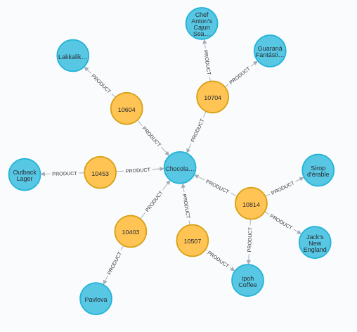

We will use this notebook to import the famous Northwind database into Neo4J. Of course, this example will help you understand how a relational database can be converted into a graph.

We will focus in sales department.


And will try to define those rows according to following ontology.


A local connection will be used.

```{r}
library(xml2)
library(neo4r)
library(magrittr)

con <- neo4j_api$new(url = "http://localhost:7474", user = "neo4j", password = "test")
```

Once the connection is established we can use Cypher to introduce our data. An existing online export of CSV files will be used, available [here](https://github.com/IraitzM/northwind/tree/master/data).

First we should notice that each row will be transformed into a NODE of a given type (LABEL) and each column will be the information to be added as node PROPERTIES.

### Customers

```{r}
"LOAD CSV WITH HEADERS FROM 'https://raw.githubusercontent.com/IraitzM/neo4j/master/data/customers.csv' AS row
CREATE (:Customer {companyName: row.CompanyName, customerID: row.CustomerID, fax: row.Fax, phone: row.Phone});" %>% call_neo4j(con)
```

For those tables where big volume is expected, PRIODIC COMMITS can be sent to the database instead of trying to push all the information at once.

### Products

```{r}
"USING PERIODIC COMMIT
LOAD CSV WITH HEADERS FROM 'https://raw.githubusercontent.com/IraitzM/neo4j/master/data/products.csv' AS row
CREATE (:Product {productName: row.ProductName, productID: row.ProductID, unitPrice: toFloat(row.UnitPrice)});" %>% call_neo4j(con)
```

### Employees

```{r}
"USING PERIODIC COMMIT
LOAD CSV WITH HEADERS FROM 'https://raw.githubusercontent.com/IraitzM/neo4j/master/data/employees.csv' AS row
CREATE (:Employee {employeeID:row.EmployeeID,  firstName: row.FirstName, lastName: row.LastName, title: row.Title});" %>% call_neo4j(con)
```

### Orders

```{r}
"USING PERIODIC COMMIT
LOAD CSV WITH HEADERS FROM 'https://raw.githubusercontent.com/IraitzM/neo4j/master/data/orders.csv' AS row
MERGE (order:Order {orderID: row.OrderID}) ON CREATE SET order.shipName =  row.ShipName;" %>% call_neo4j(con)
```


Now that all nodes have already been created, we will need to link them. Relationship information in normilized schemes can be found as foreign key relations resolved as table columns or in case of many-to-many relationships as a separate table.

In our model, Order-Details is the link table used to relate Products with Orders (M:N) where some additional information can be found that will be added as properties to the relation.

### Order-Product relationship

```{r}
"USING PERIODIC COMMIT
LOAD CSV WITH HEADERS FROM 'https://raw.githubusercontent.com/IraitzM/neo4j/master/data/order-details.csv' AS row
MATCH (order:Order {orderID: row.OrderID})
MATCH (product:Product {productID: row.ProductID})
MERGE (order)-[pu:PRODUCT]->(product)
ON CREATE SET pu.unitPrice = toFloat(row.UnitPrice), pu.quantity = toFloat(row.Quantity);" %>% call_neo4j(con)
```

As it can be seen, flat files are always read as text so in the case of numeric information these will need to be interpreted as such.

### Employee-Order relationship

```{r}
"USING PERIODIC COMMIT
LOAD CSV WITH HEADERS FROM 'https://raw.githubusercontent.com/IraitzM/neo4j/master/data/orders.csv' AS row
MATCH (order:Order {orderID: row.OrderID})
MATCH (employee:Employee {employeeID: row.EmployeeID})
MERGE (employee)-[:SOLD]->(order);" %>% call_neo4j(con)
```

### Customer-Order relationship

```{r}
"USING PERIODIC COMMIT
LOAD CSV WITH HEADERS FROM 'https://raw.githubusercontent.com/IraitzM/neo4j/master/data/orders.csv' AS row
MATCH (order:Order {orderID: row.OrderID})
MATCH (customer:Customer {customerID: row.CustomerID})
MERGE (customer)-[:PURCHASED]->(order);" %>% call_neo4j(con)
```


Visually can be difficult to solve some of the questions we will try to solve below but here is where your Cypher expertise will be put into practice.

## Question number 1

Who sold more *Chocolade*?


```{r}
"MATCH ..."
```


## Question number 2

Which product has a higher selling rate?


```{r}
"MATCH ..."
```


## Question number 3

Which one is the product most frequently sold in combination with *Chocolade*?



```{r}
"MATCH ..."
```


## Question number 4

How would you do a recommendation to each user? Which criteria would you follow?


```{r}
"MATCH ..."
```


